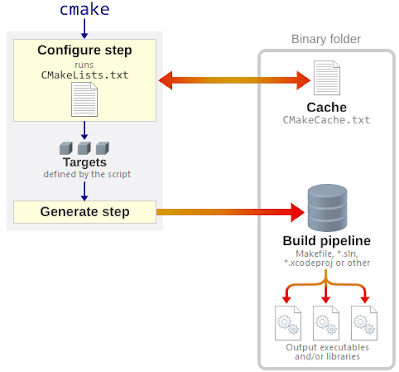

# File MakeLists.txt là gì

* CMakeLists.txt là file cấu hình chính mà cmake sử dụng để sử dụng để tạo ra các file build.
* Mỗi dự án có 1 file CMakeLists.txt ở thư mục gốc, có thể có nhiều file CMakeLists.txt ở các thư mục con để tổ chức dự án tốt hơn.
* Tóm lại file này chỉ dẫn CMake cách:
  * Tên dự án.
  * Các file thực thi hoặc thư viện.
  * Quản lý tệp nguồn, phụ thuộc.



# Các lệnh cơ bản CMakeLists.txt
>
>project(`ProjectName` [`LANGUAGES` `languageName` ...])

Dùng để khai báo tên dự án và một số thông tin như ngôn ngữ lập trình sử dụng.

Ví dụ:

```cmake
project(HelloProject LANGUAGES C)
```

>add_executable(`targetName` `source1` `source2` ...)
Lệnh này tạo một file thực thi (executable) từ các tệp nguồn (source files).

* `targetName`: tên của file thực thi sẽ được tạo ra.
* `source1`, `source2`, ...: danh sách các tệp nguồn cần biên dịch.

Ví dụ:

```cmake
add_executable(myapp main.cpp)
```

>add_library(`targetName` [STATIC | SHARED | INTERFACE] `source1` `source2` ...)

Nếu bạn muốn tạo một thư viện (library) thay vì file thực thi, hãy dùng add_library(). Thư viện có thể là static (.a/.lib), shared (.so/.dll), hoặc header-only.

* `LibraryName`: Tên của thư viện.
* `[STATIC | SHARED | INTERFACE]`: Loại thư viện (mặc định là STATIC nếu không chỉ định).
  * `STATIC`: Tạo thư viện tĩnh (.a trên Unix, .lib trên Windows). Code được copy trực tiếp vào executable.
  * `SHARED`: Tạo thư viện động (.so trên Unix, .dll trên Windows). Code được liên kết tại runtime.
  * `INTERFACE`: ảo, không compile, chỉ chứa thông tin về include directories, compile options, dependency, v.v. Thường dùng cho header-only libraries.

# Biến Và Cú Pháp Cơ Bản Trong CMake

CMake sử dụng biến để lưu trữ thông tin và làm cho file CMakeLists.txt linh hoạt hơn. Một số biến phổ biến:

* `CMAKE_CXX_COMPILER`: Trình biên dịch C++ được sử dụng.
* `CMAKE_SOURCE_DIR`: Thư mục gốc của dự án (nơi chứa CMakeLists.txt chính).
* `CMAKE_BINARY_DIR`: Thư mục nơi các file build được tạo ra (thường là thư mục build).

Tự định nghĩa biến bằng `set`
>set(`VAR_NAME` `value`)

Ví dụ:

```cmake
set(MY_VAR "Hello, CMake!")
set(MY_LIST_STRING "file1.cpp;file2.cpp;file3.cpp")
set(MY_LIST_SEPARATED file1.cpp file2.cpp file3.cpp)
```

Cách sử dụng biến:
>${`VAR_NAME`}

```cmake
message(STATUS "The value of MY_VAR is: ${MY_VAR}")
add_executable(myapp ${MY_LIST_STRING})
```

Comment trong CMakeLists.txt:

```cmake
# CMakeLists.txt
# Đây là một comment trong CMakeLists.txt
```

Ví dụ một file CMakeLists.txt đơn giản:

```cmake
# Yêu cầu phiên bản CMake tối thiểu
cmake_minimum_required(VERSION 3.10) 
# Đặt tên dự án và ngôn ngữ sử dụng
project(variable_example LANGUAGES CXX)
# Định nghĩa một biến
set(MY_VAR "Hello, CMake!")
# In giá trị của biến ra
message(STATUS "The value of MY_VAR is: ${MY_VAR}")
message(STATUS "CMAKE_SOURCE_DIR: ${CMAKE_SOURCE_DIR}")
message(STATUS "CMAKE_BINARY_DIR: ${CMAKE_BINARY_DIR}")
```

Kết quả:

```bash
bash
-- The value of MY_VAR is: Hello, CMake!
-- CMAKE_SOURCE_DIR: D:/Code/Makefile/cau_truc_co_ban_cmake/code
-- CMAKE_BINARY_DIR: D:/Code/Makefile/cau_truc_co_ban_cmake/code/build
```
