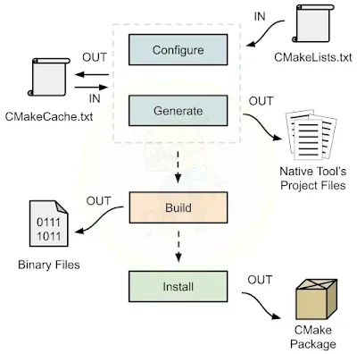

# Cmake là gì

* CMake là một công cụ **build system generator** mã nguồn mở.
* Quản lý quá trình biên dịch phần mềm một cách đơn giản và đa nền tảng.
* Nơi mô tả dự án (file nguồn, thư viện, cấu hình) trong một file **CMakeLists.txt**.
* CMake tự động tạo ra Makefile (hoặc các file cấu hình khác) phù hợp với hệ điều hành và công cụ biên dịch.

# Các stages của Cmake



* **Configure Stage:** dịch tập lệnh CMake trong file CMakeLists.txt đã viết và cập nhật các biến bộ nhớ đệm trong file CMakeCache.txt
* **Generation Stage:** tạo các file cho project cho từng 'target' được định nghĩa trong file CMakeLists.txt.
* **Build Stage:** build project giống như build trên Visual Studio IDE, dựa trên các file cấu hình đã tạo. Build Stage với CMake là tùy chọn vì sau khi Generation Stage hoàn tất, có thể mở solution bằng IDE build nó từ đó.
* **Install Stage:** tạo các gói CMake từ code để có thể đưa nó vào một nơi khác bằng cách đóng gói trước rồi sử dụng hàm find_package(..). Tạo điều kiện thuận lợi cho việc đưa vào các dependencies của dự án bên ngoài và tạo các CMake script đơn giản hơn.

> Ví dụ chương trình đơn giản sau

```c
// main.c
#include <stdio.h>
int main() {
    printf("Hello, CMake!\n");
    return 0;
}
```

```cmake
# CMakeLists.txt
cmake_minimum_required(VERSION 3.10)
project(HelloProject C)
add_executable(hello main.c)
```

> Chạy cmake và build chương trình

```bash
bash
# tạo thư mục build và cd vào
$ mkdir build
$ cd build

# tạo file build (mặc định)
$ cmake ..
# Chỉ định makefile
$ cmake -G "MinGW Makefiles" ..
# Hoặc nếu dùng ninja
$ cmake -G "Ninja" ..

# compiler (tool build la make)
$ make
# compiler (tool build la ninja)
$ cmake --build .
# hoặc
$ ninja

# chạy chương trình
$ ./hello
```

> Kết quả

```bash
Hello, CMake!
```
